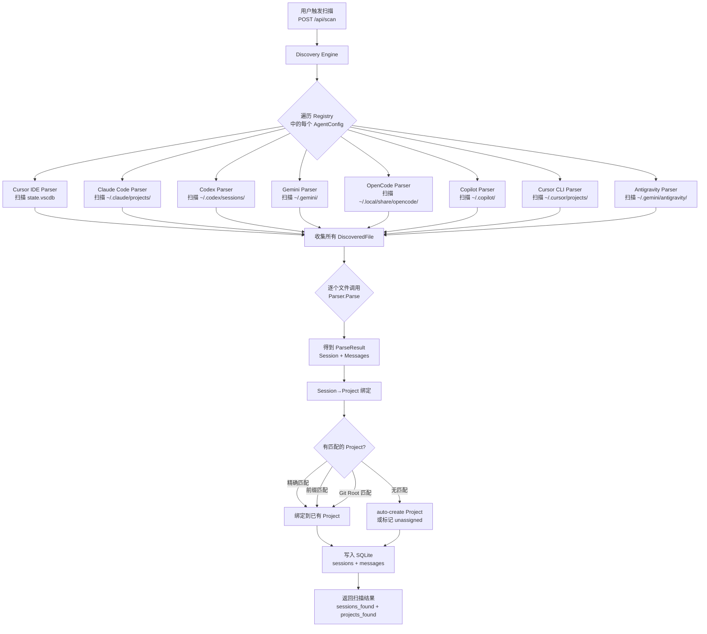
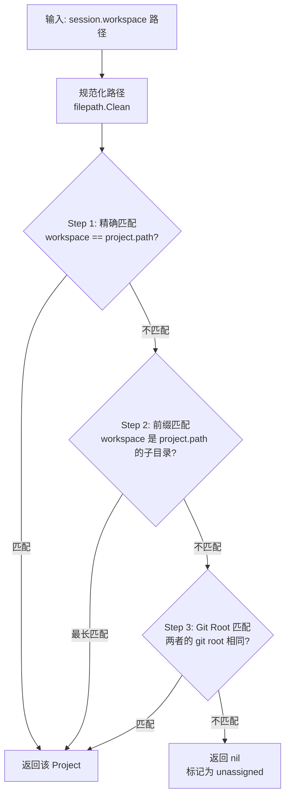
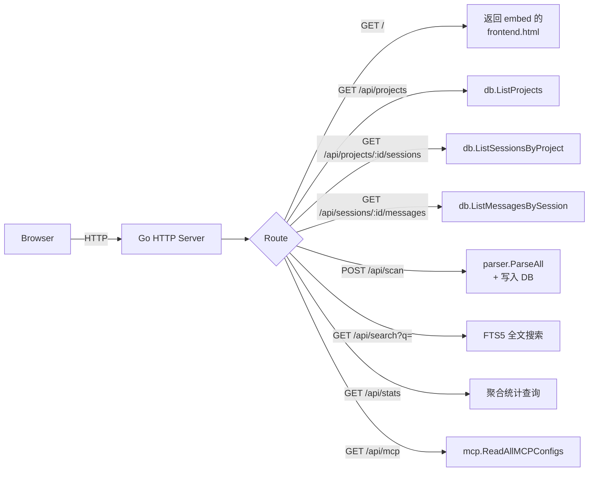
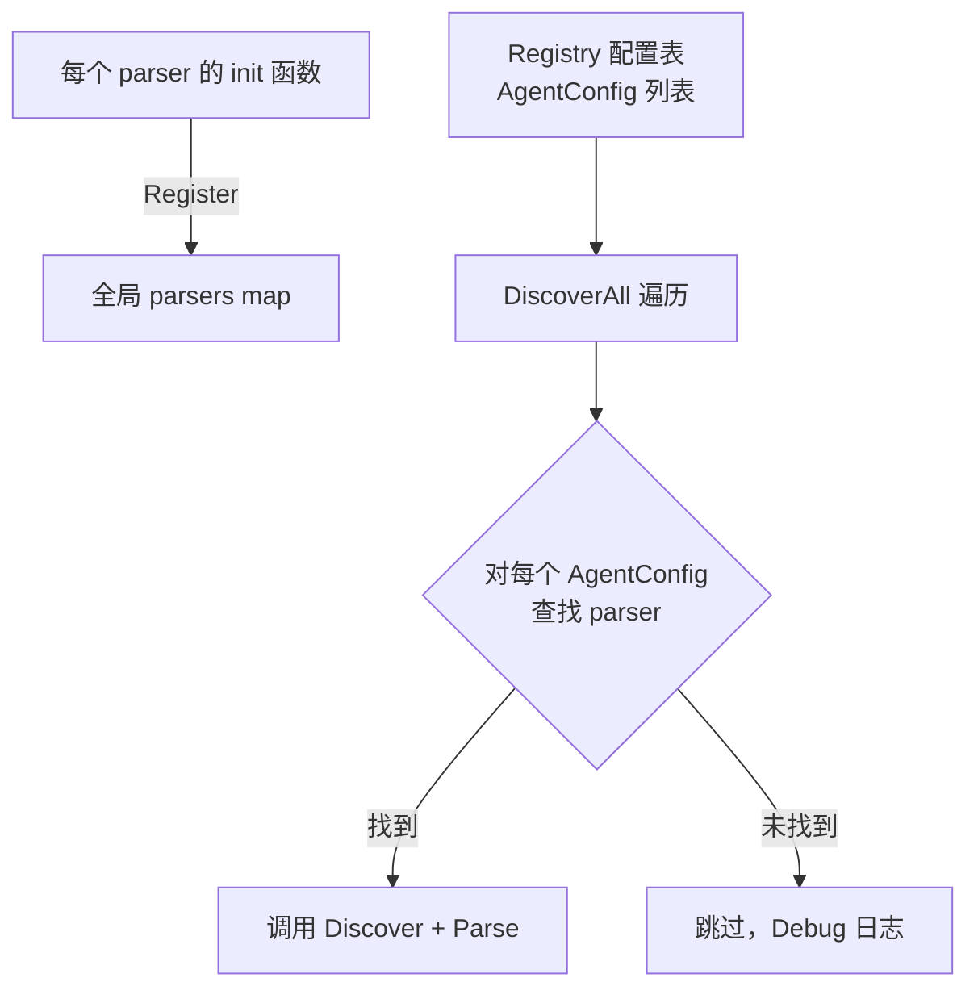
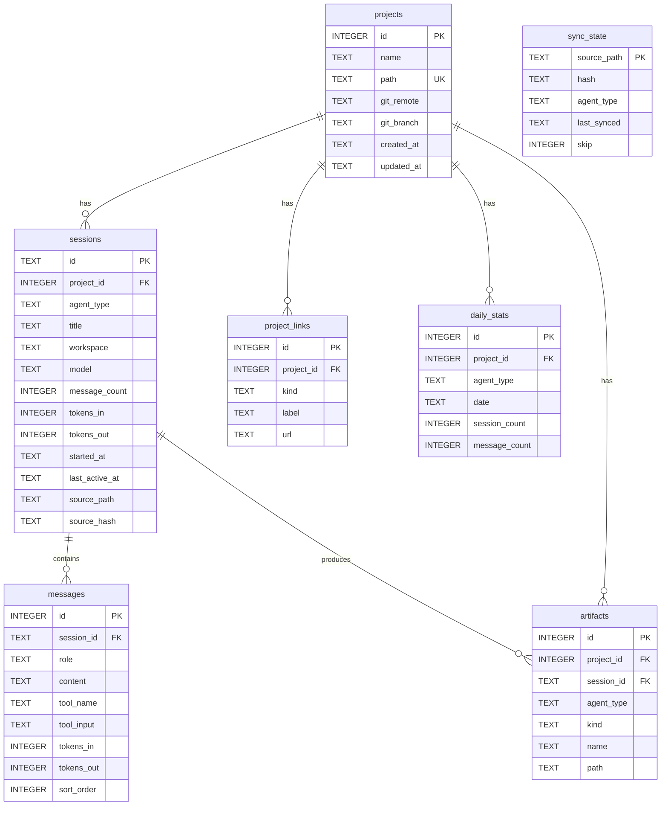
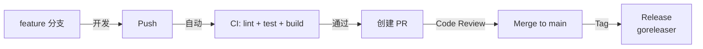

# SlashStage — 技术架构文档

> **版本**: 0.1.0 (MVP)
> **最后更新**: 2026-03-27

---

## 1. 系统概览

SlashStage 是一个**本地优先的 Web 应用**，用 Go 构建单一二进制文件，包含 HTTP Server、Parser 引擎、SQLite 数据库和内嵌前端。

```
用户浏览器 (localhost:3000)
      │
      │ HTTP (REST API + 静态前端)
      ▼
┌───────────────────────────────────┐
│        Go HTTP Server             │
│   (net/http, embed frontend)      │
│                                   │
│  ┌─────────┐  ┌──────────────┐   │
│  │ REST API │  │ Static Files │   │
│  └────┬─────┘  └──────────────┘   │
│       │                           │
│  ┌────▼──────────────────────┐    │
│  │       Business Logic       │    │
│  │  ┌────────┐ ┌──────────┐  │    │
│  │  │ Scan   │ │ Search   │  │    │
│  │  │ Engine │ │ (FTS5)   │  │    │
│  │  └───┬────┘ └────┬─────┘  │    │
│  │      │            │        │    │
│  │  ┌───▼────────────▼────┐   │    │
│  │  │     SQLite (WAL)    │   │    │
│  │  │  ~/.slashstage/     │   │    │
│  │  │     data.db         │   │    │
│  │  └─────────────────────┘   │    │
│  └────────────────────────────┘    │
│                                    │
│  ┌────────────────────────────┐    │
│  │     Parser Layer           │    │
│  │  (可插拔 Registry 架构)     │    │
│  │                            │    │
│  │  ┌──────────┐ ┌─────────┐ │    │
│  │  │Cursor IDE│ │Claude   │ │    │
│  │  │(SQLite)  │ │(JSONL)  │ │    │
│  │  └──────────┘ └─────────┘ │    │
│  │  ┌──────────┐ ┌─────────┐ │    │
│  │  │Codex CLI │ │Gemini   │ │    │
│  │  │(JSONL)   │ │(JSON)   │ │    │
│  │  └──────────┘ └─────────┘ │    │
│  │  ┌──────────┐ ┌─────────┐ │    │
│  │  │OpenCode  │ │Copilot  │ │    │
│  │  │(SQLite)  │ │(JSON)   │ │    │
│  │  └──────────┘ └─────────┘ │    │
│  │  ┌──────────┐ ┌──────────┐│    │
│  │  │Cursor CLI│ │Antigrav. ││    │
│  │  │(JSONL)   │ │(Protobuf)││    │
│  │  └──────────┘ └──────────┘│    │
│  └────────────────────────────┘    │
│                                    │
│  ┌────────────────────────────┐    │
│  │     MCP Config Reader      │    │
│  │  Cursor / Claude / Codex   │    │
│  └────────────────────────────┘    │
└────────────────────────────────────┘
        │
        │ 读取本地文件系统
        ▼
   各 IDE 数据目录
   (state.vscdb, JSONL, JSON, SQLite)
```

---

## 2. 目录结构

```
slashstage/
├── cmd/
│   └── slashstage/
│       └── main.go              # CLI 入口，启动 HTTP server
├── internal/
│   ├── db/
│   │   ├── db.go                # SQLite 连接 + 初始化
│   │   ├── schema.sql           # DDL（嵌入 Go 二进制）
│   │   ├── projects.go          # projects 表 CRUD
│   │   ├── sessions.go          # sessions 表 CRUD
│   │   ├── messages.go          # messages 表 CRUD
│   │   └── sync_state.go        # sync_state 表 CRUD
│   ├── model/
│   │   └── model.go             # 核心数据结构（Project, Session, Message, AgentConfig）
│   ├── parser/
│   │   ├── parser.go            # Parser 接口 + Registry + Register()
│   │   ├── discovery.go         # DiscoverAll() + ParseAll() + DiscoverProjects()
│   │   ├── project.go           # GetProjectName() + findGitRepoRoot()
│   │   ├── cursor_ide.go        # Cursor IDE parser (state.vscdb SQLite)
│   │   ├── cursor_cli.go        # Cursor CLI parser (agent-transcripts JSONL)
│   │   ├── claude.go            # Claude Code parser (JSONL)
│   │   ├── codex.go             # Codex CLI parser (JSONL)
│   │   ├── gemini.go            # Gemini CLI parser (JSON)
│   │   ├── opencode.go          # OpenCode parser (SQLite)
│   │   ├── copilot.go           # Copilot CLI parser (JSON)
│   │   └── antigravity.go       # Antigravity parser (Protobuf metadata)
│   ├── server/
│   │   ├── server.go            # HTTP server + 路由 + API handlers
│   │   ├── helpers.go           # writeJSON / writeError 工具函数
│   │   └── frontend.html        # 内嵌前端（embed 到 Go 二进制）
│   ├── export/
│   │   ├── markdown.go          # Session → Markdown 导出
│   │   └── markdown_test.go     # 导出单元测试
│   ├── mcp/
│   │   └── reader.go            # 读取各 IDE 的 MCP 配置
│   └── sync/                    # （计划中）增量同步引擎
├── docs/
│   └── ARCHITECTURE.md          # 本文档（技术架构）
├── .github/
│   ├── workflows/
│   │   └── ci.yml               # CI: lint → test → security → build
│   ├── dependabot.yml           # 自动依赖更新（Go + Actions）
│   └── PULL_REQUEST_TEMPLATE.md # PR 模板
├── .golangci.yml                # golangci-lint 配置
├── Makefile                     # 标准构建命令
├── CONTRIBUTING.md              # 贡献指南（commit/branch/PR 规范）
├── go.mod
├── go.sum
└── .gitignore
# 以下为本地私有文件（通过 .git/info/exclude 排除，不在远端）
# ├── reference/                 # 私有文档目录（整个文件夹被排除）
# │   ├── TASK.md                # Sprint 任务追踪
# │   └── PRD.md                 # 产品需求文档
```

---

## 3. 核心数据流

### 3.1 全局扫描流程



### 3.2 Session → Project 绑定算法



### 3.3 API 请求处理流程



---

## 4. 可插拔 Parser 架构

### 4.1 Parser 接口

每个 IDE/CLI 只需实现两个方法：

```go
type Parser interface {
    Discover(config AgentConfig) ([]DiscoveredFile, error)  // 发现文件
    Parse(path string) ([]ParseResult, error)               // 解析 session
}
```

### 4.2 注册流程



### 4.3 添加新 IDE 的步骤

1. 在 `model/model.go` 中添加 `AgentType` 常量
2. 在 `parser/parser.go` 的 `Registry` 中添加 `AgentConfig`
3. 创建 `parser/newtool.go`，实现 `Parser` 接口
4. 在 `init()` 中调用 `Register()`
5. **无需修改其他任何代码**（API、UI、搜索自动适配）

---

## 5. 数据库设计

### 5.1 ER 图



### 5.2 关键设计选择

| 选择 | 原因 |
|------|------|
| **SQLite + WAL 模式** | 读写并发，UI 不阻塞 |
| **FTS5 全文搜索** | 毫秒级搜索，无需外部搜索引擎 |
| **Triggers 同步 FTS** | 自动维护搜索索引一致性 |
| **sync_state 表** | SHA-256 hash 比对，支持增量同步 |
| **`modernc.org/sqlite`** | 纯 Go，无 CGO 依赖，跨平台零配置编译 |

---

## 6. 技术栈

| 层 | 技术 | 版本 | 选择理由 |
|----|------|------|----------|
| **语言** | Go | 1.26+ | 单二进制分发，高性能并发 |
| **HTTP** | `net/http` (stdlib) | — | Go 1.22+ 原生支持路由模式 |
| **数据库** | SQLite | — | 本地优先，零配置 |
| **SQLite 驱动** | `modernc.org/sqlite` | v1.47 | 纯 Go，无 CGO |
| **前端 (MVP)** | HTML + CSS + JS | — | 内嵌 `embed`，零构建依赖 |
| **前端 (计划)** | Svelte 5 | — | 轻量 SPA，agentsview 已验证 |
| **CI** | GitHub Actions | — | 免费，Actions pinned to SHA |
| **安全扫描** | govulncheck | — | Go 官方漏洞数据库 |
| **依赖管理** | Dependabot | — | 自动更新 Go deps + Actions |
| **Lint** | golangci-lint | v2 | Go 社区标准 linter 聚合器 |
| **分发** | goreleaser | — | 跨平台二进制 + Homebrew |

---

## 7. API 端点清单

| 方法 | 路径 | 描述 | 状态 |
|------|------|------|------|
| `GET` | `/` | 返回内嵌前端 HTML | ✅ |
| `GET` | `/api/projects` | 列出所有项目 | ✅ |
| `POST` | `/api/projects` | 创建项目 | ✅ |
| `GET` | `/api/projects/{id}` | 获取单个项目 | ✅ |
| `DELETE` | `/api/projects/{id}` | 删除项目 | ✅ |
| `GET` | `/api/projects/{id}/sessions` | 项目的 session 列表 | ✅ |
| `GET` | `/api/projects/{id}/config` | 项目的 MCP 配置 | ✅ |
| `GET` | `/api/sessions/{id}` | 获取单个 session | ✅ |
| `GET` | `/api/sessions/{id}/messages` | session 的消息列表 | ✅ |
| `GET` | `/api/sessions/{id}/export/markdown` | 导出 session 为 Markdown | ✅ |
| `GET` | `/api/sessions/unassigned` | 未分配的 session | ✅ |
| `POST` | `/api/scan` | 触发全局扫描 | ✅ |
| `GET` | `/api/search?q=` | 全文搜索消息 | ✅ |
| `GET` | `/api/mcp` | 所有 IDE 的 MCP 配置 | ✅ |
| `GET` | `/api/stats` | 全局统计信息 | ✅ |
| `GET` | `/api/health` | 健康检查 | ✅ |
| `GET` | `/api/events` | SSE 实时推送 | 📋 计划 |
| `POST` | `/api/sessions/{id}/switch` | 一键切换 IDE | 📋 计划 |

---

## 8. 构建与部署

### 8.1 开发流程



### 8.2 本地开发命令

```bash
make build     # 编译二进制
make test      # 运行测试
make lint      # 代码检查
make run       # 编译 + 运行
make clean     # 清理构建产物
make ci        # 完整 CI 流程 (lint + test + build)
```

### 8.3 分发

```bash
# 用户安装
brew install slashstage                            # macOS
go install github.com/kuk1song/slashstage@latest  # 跨平台

# 启动
slashstage  # → 自动打开 http://localhost:3000
```

---

## 9. 安全与隐私

| 原则 | 说明 |
|------|------|
| **完全本地** | 所有数据存储在 `~/.slashstage/data.db`，不联网 |
| **只读访问 IDE 数据** | 只读取各 IDE 的数据文件，不写入 |
| **MCP 写入保护** | 写入 MCP 配置前必须备份原文件 + diff 预览 |
| **无认证** | localhost 单用户应用，无需登录 |
| **CI 供应链安全** | 所有 GitHub Actions pinned to commit SHA，Dependabot 自动更新 |
| **依赖校验** | `go mod verify` 验证 checksums，`govulncheck` 扫描已知漏洞 |
| **私有文档隔离** | `reference/` 目录通过 `.git/info/exclude` 整体排除，远端完全不可见 |

---

## 10. 未来架构演进

| 阶段 | 变更 | 影响 |
|------|------|------|
| **v0.2** | 增量同步引擎 (fsnotify + Worker Pool) | 新增 `internal/sync/` |
| **v0.2** | Svelte 5 前端替换内嵌 HTML | 新增 `frontend/` |
| **v0.3** | 内置 Session 转换引擎 | 新增 `internal/converter/` |
| **v0.4** | Tauri 桌面包装 | 新增 `src-tauri/` |
| **v1.0** | PostgreSQL 团队同步 (可选) | `internal/db/` 抽象接口 |
